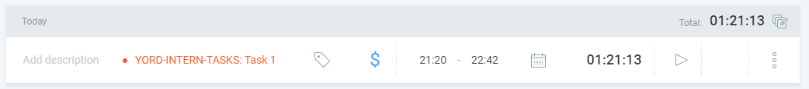
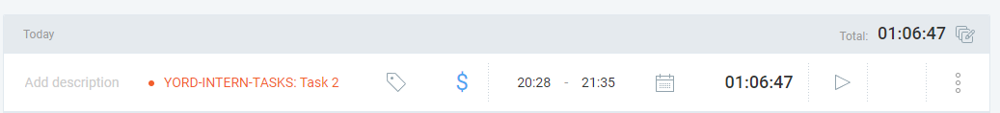
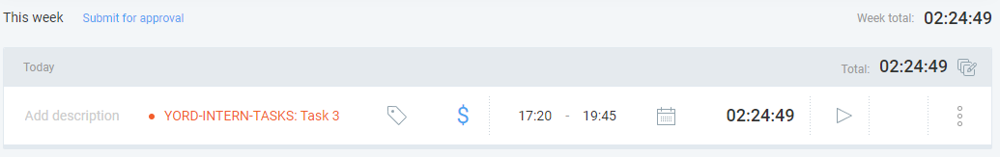

# YORD Intern Task Solutions by Yiwen Zhang

Solutions for the QA Tester & DEV Intern take-home task at YORD.

## About this repo
 
I used Markdown for all tasks to keep everything in one place with full commit history and for a better document format. Task 4 links out to an existing personal project of mine.
Work on this repo spans **July 30 – August 4**, with the full commit history reflecting the actual working process (see commits for a day-by-day breakdown).

## Task 1 — VR Safety Training Simulator: Test Plan

📄 [`task1.md`](./task1.md)

**Time spent:** 1 hour 21 minutes (recorded by Clockify)
 

## Task 2 — What Would You Do Next? (Prioritization Exercise)

📄 [`task2.md`](./task2.md)

**Time spent:** 1 hour 6 minutes 47 seconds (recorded by Clockify)
 

## Task 3 — Future Prague: QA Report

📄 [`task3.md`](./task3.md)

**Time spent:** The outdoor test lasted approximately 5 hours. Writing the QA report took 2 hours 24 minutes (recorded by Clockify).
 

## Task 4 — Personal Project: Prague Stories

Since I already have a project I'm proud of, I'm sharing that instead of building something new for this task. I also actually talked about this project during the interview already.

🔗 [github.com/VikingCrusader/prague-stories](https://github.com/VikingCrusader/prague-stories)
 
🔗 [Live demo](https://prague-stories.vercel.app/)

**Time spent:** 0 — this project already existed before this task.

---