# Task 3 — Future Prague (WebAR) — Test Report

**Tester:** Yiwen Zhang  
**App under test:** Future Prague — WebAR city promotion experience  
**Platform notes:** Built on 8th Wall + A-Frame (confirmed via page metadata)  

---

## 1. Test Scope

This is a manual functional QA pass on a mobile WebAR experience. The goal is to verify the user journey end-to-end, across the five landmark scenarios, and document anything unexpected.

### Devices / Browsers to cover

| #   | Device     | Browser | Notes               |
| --- | ---------- | ------- | ------------------- |
| 1   | _iPhone12_ | Safari  | Primary pass        |
| 2   | _iPhone12_ | Chrome  | Cross-browser check |

---

## 2. Test Cases

### 2.1 Entry Flow

| ID   | What to test                       | How to test                                                                          | Expected result                                                                       |
| ---- | ---------------------------------- | ------------------------------------------------------------------------------------ | ------------------------------------------------------------------------------------- |
| T1.1 | QR code scan launches experience   | Scan the physical/printed QR code (or open the link directly if no poster available) | Browser opens and loads the experience without errors                                 |
| T1.2 | Camera/location permission prompts | Observe permission dialogs on first load                                             | Clear, standard OS prompts for camera and location; app explains why if needed        |
| T1.3 | Permission denial handling         | Deny camera or location permission once, then retry                                  | App shows a clear message/fallback instead of a blank screen or crash                 |
| T1.4 | Load time                          | Time from link open to interactive experience                                        | Loads within a reasonable time (note actual seconds); loading indicator shown if slow |

### 2.2 Interactive Map / Navigation

| ID   | What to test                         | How to test                                                                  | Expected result                                                                                   |
| ---- | ------------------------------------ | ---------------------------------------------------------------------------- | ------------------------------------------------------------------------------------------------- |
| T2.1 | Map displays all 5 landmarks         | Open map view                                                                | All 5 locations visible and correctly labeled                                                     |
| T2.2 | Current location accuracy            | Compare blue dot / marker to actual physical position                        | Marker position roughly matches real-world location (allow for normal GPS margin)                 |
| T2.3 | Navigation guidance to next landmark | Follow in-app directions toward a landmark                                   | Guidance updates as you move; doesn't point in the wrong direction                                |
| T2.4 | Out-of-order visits                  | Intentionally visit a landmark that isn't "next" in the suggested sequence   | App still triggers the correct scenario and updates progress correctly, regardless of order       |
| T2.5 | Language / localization              | Check default language on load; look for a language switch option if present | Default language is clear; Czech-specific characters render correctly; no obvious mistranslations |

### 2.3 Landmark AR Scenarios

> **Note:** The task brief's example scenarios (Staroměstská personalized ads, Law Faculty cooling biotech grass) don't match the live app. The five real landmarks are: **Náměstí Republiky, Na Příkopě, Václavské náměstí, Palackého náměstí, and Výtoň.**

| ID   | Landmark          | Scenario                                        | Button label    |
| ---- | ----------------- | ----------------------------------------------- | --------------- |
| T3.1 | Náměstí Republiky | Aerospace — delivery drone overhead             | Start AR        |
| T3.2 | Na Příkopě        | Culture & Creativity — historic photo overlay   | Start AR        |
| T3.3 | Václavské náměstí | Urban Innovation — 360° future vision of Můstek | Start 360° View |
| T3.4 | Palackého náměstí | AI — emoji-based personalized ad billboard      | Start AI        |
| T3.5 | Výtoň             | Biotech — tap-to-grow AR grass                  | Start AR        |

### 2.4 Closing / Call-to-Action

| ID   | What to test                                 | Expected result                   |
| ---- | -------------------------------------------- | --------------------------------- |
| T4.1 | Completion state after all 5 landmarks       | App clearly indicates completion  |
| T4.2 | Call-to-action link to Prahainovační website | Opens correct site without errors |

### 2.5 General / Cross-Cutting

| ID   | What to test                            | Expected result                                       |
| ---- | --------------------------------------- | ----------------------------------------------------- |
| T5.1 | App backgrounding / interruption        | App resumes correctly, doesn't crash or lose progress |
| T5.2 | Poor network conditions                 | Reasonable error handling, not silent failure         |
| T5.3 | Battery/performance over time           | No excessive heating or degradation                   |
| T5.4 | Orientation (portrait/landscape)        | Layout adapts without breaking                        |
| T5.5 | Re-entering after fully closing the app | Progress preserved, or restarts from a sensible state |

---

## 3. Field Notes (all 5 landmarks tested)

### Session 1 — remote pre-check (late night, indoor, far from any landmark)

- Confirmed language toggle exists ("en" button).
- Opened "Aerospace" (Náměstí Republiky) and tapped Start AR while physically in Prague 4, indoors, at night — AR launched normally with no location check. First sign of what became **GEN-02**.
- Drone rendering appeared stable even indoors at night.

### Session 2 — Výtoň (Biotech: tap-to-grow AR grass)

- Rotating the phone around placed patches: no unwanted disappearance.
- No noticeable input latency; i18n looked fine at this landmark.
- Multiple taps at the same spot stack correctly, no glitching.
- PWA "Add to Home Screen" — **passed on iOS only**; not verified on Android due to device limitation this session (scope gap, not a fail).
- Portrait/landscape switch — smooth, no issues (**T5.4 pass**).
- 3D model scaling correct (near = big, far = small) (**pass**).
- Validation works: cannot plant in the sky or on existing green/grass areas (**pass**).
- Walking away and returning to an already-planted spot: the grass is gone → **VY-01**.
- Fully closing the browser tab and reopening: planted progress not retained → **VY-02**.
- Covering the camera lens entirely: still able to place grass → **VY-03**.
- Some icons occasionally needed multiple taps before responding → **GEN-01** (not yet isolated to one specific icon).
- Pinch gesture (two fingers together) reduces the on-screen "temperature" stat by 2° without planting anything → **VY-A01** (unclear if intentional shortcut or bug).
- After planting a certain number of patches, each new one causes an older one to disappear → **VY-A02** (unclear if a deliberate cap/pooling mechanic or a bug).
- Grass patches sometimes flicker → **VY-A03**.
- Can plant grass on the surface of water → **VY-04** (distinct from VY-03 — this is a surface-validation gap, not a camera/plane-detection gap).
- **Radius check:** while physically at Palackého náměstí, was still able to open and plant grass in the Výtoň (Biotech) scenario → strong supporting evidence for **GEN-02** (see below — proximity is not enforced).

### Session 3 — Palackého náměstí (AI: emoji-based personalized ad billboard)

- Billboard can be occluded by real-world trees/utility poles — visually correct (respects real depth) but looks unpolished → **PN-A01**.
- Switching the app to background (not closing the browser, just switching apps) and returning: the billboard disappears → **PN-01**. This is distinct from VY-02 (which is a full browser close) and arguably more severe, since backgrounding happens far more casually (e.g. taking a call).
- Rotating the camera 360° while the billboard is active: no issues found (**pass**).
- Tapping elsewhere on screen moves the billboard's position — correct, expected reactive behavior (**pass**).
- Billboard only appears when pointing at the sky; tapping ground, buildings, or water does not trigger it — validation works as intended (**pass**).
- Tested 5 different mood emojis: all produced different, correctly varied ad content (**pass**) — though all 5 runs shared the same GEN-02/PN-01 issues above.
- Confirmed again here: app can be opened and the scenario triggered from anywhere, not just on-site → additional evidence for **GEN-02**.

### Session 4 — Náměstí Republiky (Aerospace: delivery drone)

- Drone model rendering quality itself is fine — no texture/model issues (**pass**).
- When the phone gets very close to the drone, it sometimes flies erratically/unpredictably → **NR-01**.
- Drone clips through geometry — near buildings it can get stuck inside a wall, with only the propellers visible outside → **NR-02**.

### Session 5 — Na Příkopě (Culture & Creativity: historic photo overlay)

- No functional crash-type bugs found here, but UX has real room for improvement:
  - Confirmed again: the camera/filter can be opened and used from anywhere, facing any direction — not gated to being on-site and facing the correct direction → further evidence for **GEN-02**.
  - Feedback is weak: the historic photo is just a flat overlay filter: the user has to manually drag a slider/axis to control how strongly the filter is applied, rather than the app automatically rendering the blend → **NP-A01** (UX suggestion, not a functional bug).

### Session 6 — Václavské náměstí (Urban Innovation: 360° future vision)

- 360° look-around (rotating in place) works correctly with no issues (**pass**).
- Moving forward/backward physically does not move the scene at all — only rotation is reflected, so the user feels "stuck in place" inside the AR environment even while walking → **VN-01**.
- Confirmed again: can be opened and triggered from anywhere, seeing the identical scene regardless of actual location → further evidence for **GEN-02**.
- Visual style is jarring: half of the scene is hyper-futuristic, half is unchanged historic Prague, and the transition between the two feels abrupt → **VN-A02** (design/UX opinion, not a functional bug).
- The view can also be rotated by swiping a finger on screen, in addition to physically rotating the phone → **VN-A01** — worth raising as a UX question: for a "true" AR/360° experience, should view rotation come only from the device's physical orientation, to keep it immersive, rather than also allowing a swipe-to-look shortcut?

---

## 4. Findings Summary (Triaged)

### 4.1 Confirmed Bugs

| ID     | Title                                                                                | Landmark(s)                 | Severity    | Steps to Reproduce                                                                                                                              | Expected                                                                            | Actual                                                                                                 |
| ------ | ------------------------------------------------------------------------------------ | --------------------------- | ----------- | ----------------------------------------------------------------------------------------------------------------------------------------------- | ----------------------------------------------------------------------------------- | ------------------------------------------------------------------------------------------------------ |
| VY-01  | Planted grass disappears after walking away and returning                            | Výtoň                       | Medium      | 1. Plant grass 2. Walk away from the spot 3. Return                                                                                             | Previously grown grass should still be there                                        | Grass is gone                                                                                          |
| VY-02  | Progress lost after fully closing the browser tab                                    | Výtoň (likely app-wide)     | Medium      | 1. Plant grass / make progress 2. Fully close browser tab 3. Reopen the link                                                                    | Progress preserved, or app clearly signals a fresh start                            | Progress silently lost                                                                                 |
| VY-03  | AR object placement works with the camera fully covered                              | Výtoň                       | High        | 1. Cover the camera lens completely 2. Attempt to tap-to-place grass                                                                            | Placement should fail or be blocked without a detected real-world plane             | Grass places successfully anyway                                                                       |
| GEN-01 | Some icons require multiple taps before responding                                   | Multiple (not yet isolated) | Low–Medium  | Tap certain icons once                                                                                                                          | Icon responds on first tap                                                          | Sometimes requires 2+ taps                                                                             |
| PN-01  | App state lost when backgrounding (not closing) the app                              | Palackého náměstí           | High        | 1. Trigger the AI ad billboard 2. Switch to another app 3. Return to the browser tab                                                            | Billboard/state should persist through a simple app switch                          | Billboard disappears                                                                                   |
| NR-01  | Drone flies erratically when the phone gets very close                               | Náměstí Republiky           | Medium      | Move phone very close to the rendered drone                                                                                                     | Drone continues its normal flight path/animation                                    | Drone behavior becomes erratic                                                                         |
| NR-02  | Drone clips through building geometry                                                | Náměstí Republiky           | Medium      | Move near a building while the drone is nearby                                                                                                  | Drone should respect building geometry, stay visible/on a valid path                | Drone gets stuck inside a wall, only propellers visible                                                |
| VN-01  | No parallax/translation when moving forward/backward                                 | Václavské náměstí           | Medium–High | Physically walk forward or backward while in the 360° scene                                                                                     | Scene should reflect forward/backward movement (even if only 360° rotation is core) | Only rotation is reflected; moving forward/back has no visible effect                                  |
| VY-04  | Grass can be planted on the surface of water                                         | Výtoň                       | Low–Medium  | Aim the placement reticle at a water surface and tap                                                                                            | Placement should be blocked on water, same as sky                                   | Grass places successfully on water                                                                     |
| NP-01  | Landscape orientation not supported                                                  | Na Příkopě                  | Low         | Rotate phone to landscape while in the historic-photo scenario                                                                                  | Layout adapts, or is intentionally locked with a clear indication                   | Screen does not rotate / landscape not supported                                                       |
| NP-02  | Wireframe outline disappears after dragging the match timeline back                  | Na Příkopě                  | Medium      | 1. Trigger "Match with history" and let the historic photo render fully 2. Drag the comparison slider/timeline back toward the present-day view | Red wireframe guide should still be available/reappear as needed                    | Red wireframe outline does not come back once the photo has fully rendered once                        |
| NP-03  | Wireframe outline still shows when pointing at the sky instead of a guidance message | Na Příkopě                  | Low–Medium  | Point the camera at the sky instead of the target building                                                                                      | App should show a message prompting the user to point at the correct building       | The red wireframe outline is still displayed, rather than a clear "point at the building" style prompt |

**Screenshots — Na Příkopě (NP-01, NP-02, NP-03, plus a UX note):**

<table>
<tr>
<td width="33%" align="center">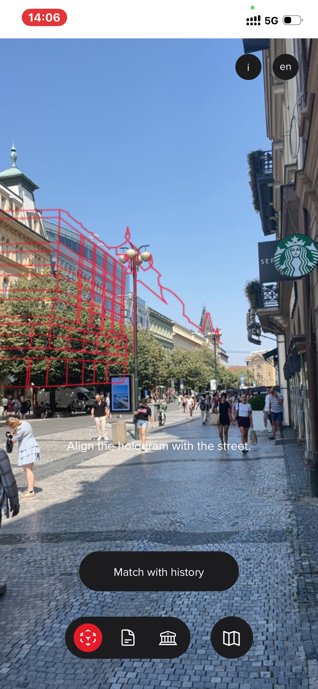 <em>Normal state — wireframe aligned with the building</em></td>
<td width="33%" align="center">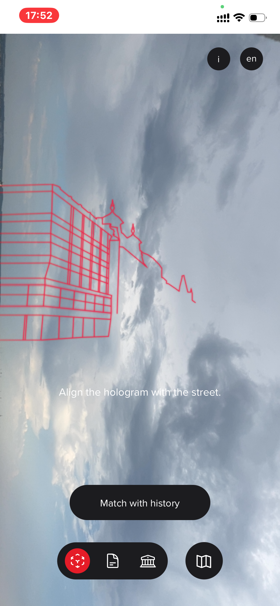 <em>NP-03 — pointed at sky, outline still shown</em></td>
<td width="33%" align="center">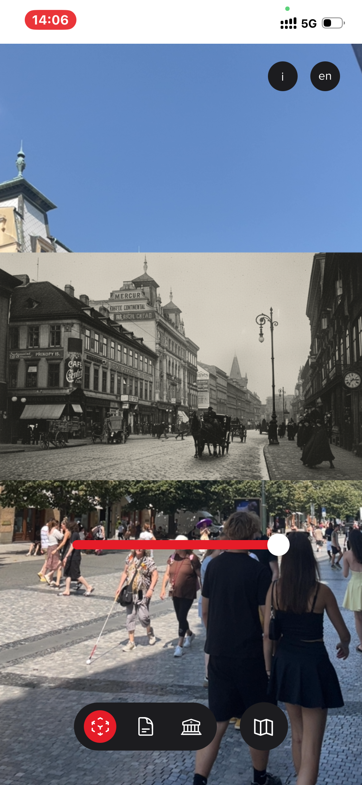 <em>NP-A02 — fully opaque background (UX note)</em></td>
</tr>
</table>

- **np01:** normal reference — wireframe correctly aligned with the building when pointing at street level (also used to confirm NP-01: no landscape rotation available from this screen).
- **np02:** NP-03 — camera pointed at the sky (not the building), yet the red wireframe overlay is still shown rather than a message asking the user to point at the correct target. Also visible here: no landscape orientation support.
- **np03:** not a bug, but a UX suggestion (NP-A02) — everything except the building itself (sky, street, people) renders as a fully opaque historic photo layer. Making the non-building background transparent, so only the building itself is "replaced" by its historic version, would likely feel more immersive and blend better with the live camera view.

**Screenshots — Náměstí Republiky (NR-01, NR-02):**

<table>
<tr>
<td width="50%" align="center">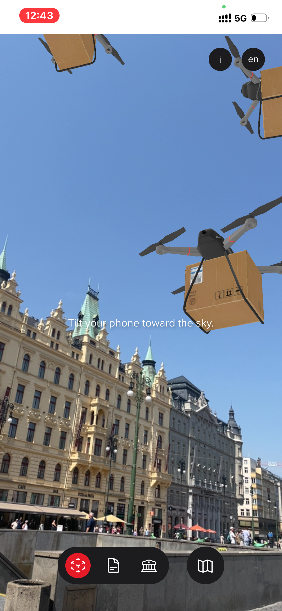 <em>NR-01 — normal reference (erratic flight itself couldn't be captured)</em></td>
<td width="50%" align="center">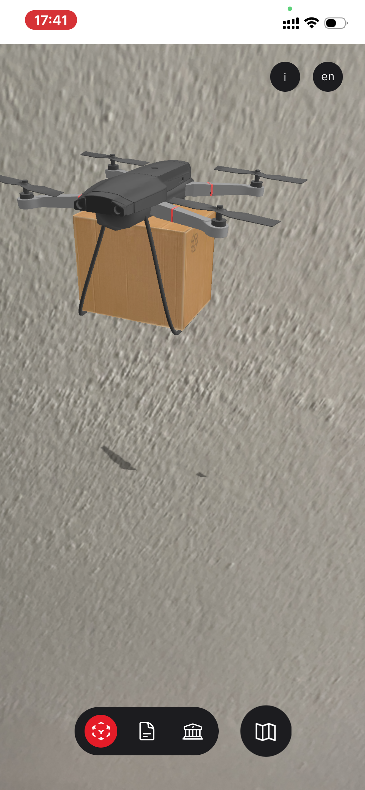 <em>NR-02 — drone clipped inside a wall, only propellers visible</em></td>
</tr>
</table>

NR-01 could not be directly screenshotted, since the erratic movement is unpredictable and brief — it doesn't reproduce on demand, only observed occasionally when the phone gets very close. The left image above is included only as a "normal behavior" reference point.

**Screenshots — Výtoň (VY-03, VY-04):**

<table>
<tr>
<td width="50%" align="center">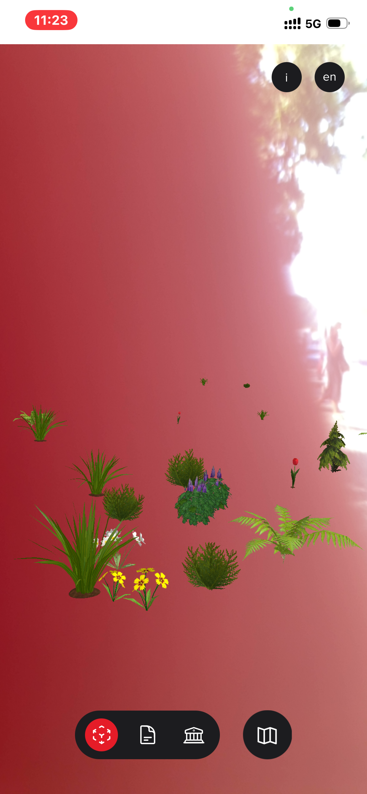 <em>VY-03 — grass placed with camera fully covered</em></td>
<td width="50%" align="center">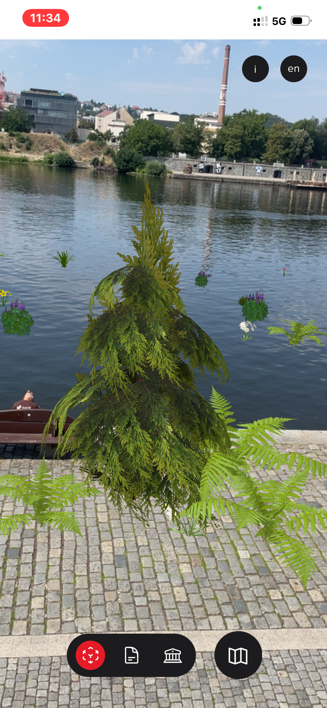 <em>VY-04 — grass planted on the river surface</em></td>
</tr>
</table>

### 4.2 Bug GEN-02 — Location Proximity Not Enforced (cross-landmark, highest-confidence finding)

**Severity:** High (pending confirmation of intended behavior)

**Observed at:** Náměstí Republiky, Palackého náměstí (from a different landmark's location), Na Příkopě, and Václavské náměstí — i.e. at least 4 of the 5 landmarks.

**Steps to Reproduce:** Open any landmark's scenario page while physically located elsewhere (tested from multiple different real distances/locations across sessions), and tap the Start button.

**Expected:** If proximity to the real landmark is meant to be required, the app should block or warn instead of starting the AR/360°/AI experience.

**Actual:** Every scenario tested launched normally regardless of actual physical location, with no location check or warning at any point.

**Note:** Given how consistently this reproduced across four different landmarks and sessions, this is the single highest-confidence, most impactful finding in this report — flagged as a question for the team (see Assumptions & Questions) rather than an assumed bug, since a deliberate "preview from anywhere" mode is also plausible.

**Screenshot — GEN-02 (Výtoň's Biotech scenario opened and planted while physically standing at Palackého náměstí):**

<table>
<tr>
<td width="50%" align="center">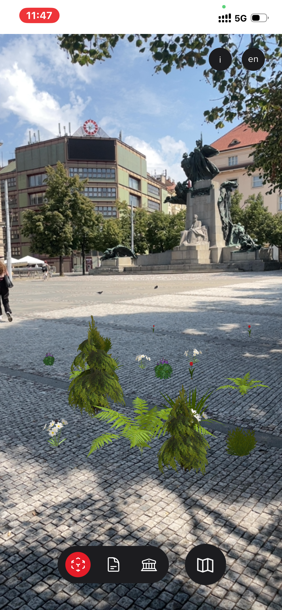 <em>Výtoň grass scenario open and plantable while physically located at Palackého náměstí</em></td>
</tr>
</table>

### 4.3 Ambiguous — Bug or Intentional Feature?

| ID     | Title                                                                              | Landmark          | Notes                                                                                                                              |
| ------ | ---------------------------------------------------------------------------------- | ----------------- | ---------------------------------------------------------------------------------------------------------------------------------- |
| VY-A01 | Pinch gesture reduces "temperature" stat by 2° without planting                    | Výtoň             | Could be an intentional shortcut/easter egg, or an unintended side effect of the pinch/zoom gesture handler                        |
| VY-A02 | New grass patches replace old ones after a certain count                           | Výtoň             | Could be a deliberate object-pooling/cap mechanic (performance-related), or a bug in how patches are tracked                       |
| VY-A03 | Grass patches sometimes flicker                                                    | Výtoň             | Possibly a z-fighting/rendering issue; frequency and trigger condition not yet fully isolated                                      |
| PN-A01 | Ad billboard gets occluded by trees/utility poles                                  | Palackého náměstí | Technically correct (respects real-world depth) but makes the experience feel broken to a casual user                              |
| VN-A01 | View can be rotated by finger swipe, not just physical device rotation             | Václavské náměstí | Worth asking whether swipe-to-look should be allowed in a "true" AR/360° experience, or whether it undermines immersion            |
| NP-A01 | Historic photo filter requires manual slider control instead of automatic blending | Na Příkopě        | UX suggestion — not a functional bug, but weakens the "wow" factor of the feature                                                  |
| NP-A02 | Non-building background renders fully opaque instead of transparent                | Na Příkopě        | UX suggestion (see screenshot np03 above) — making everything but the building itself transparent would likely feel more immersive |

**Screenshot — PN-A01 (billboard occluded by real-world objects):**

<table>
<tr>
<td width="50%" align="center">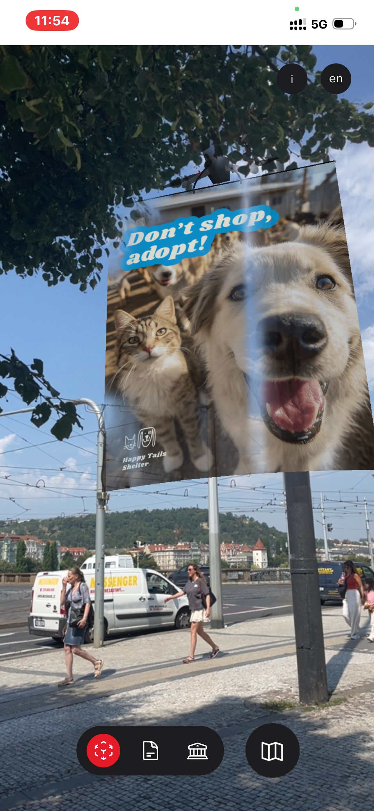 <em>Occluded by a building rooftop</em></td>
<td width="50%" align="center">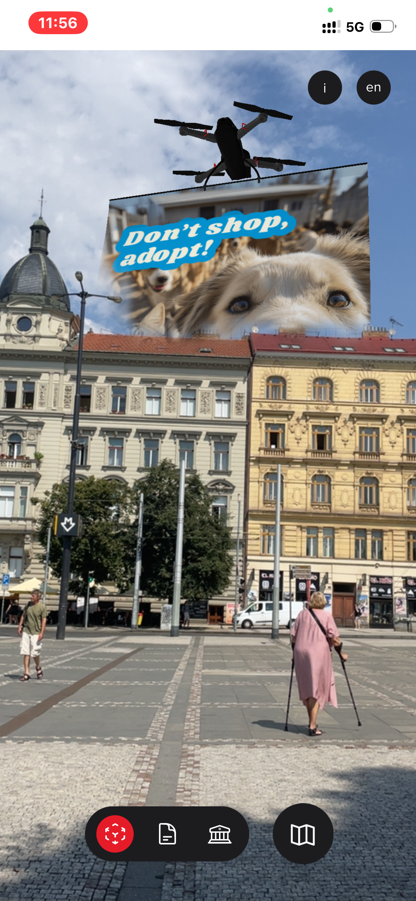 <em>Occluded by a tree branch and utility pole</em></td>
</tr>
</table>

Both screenshots show the billboard correctly respecting real-world depth (the building and tree/pole render in front of it as expected), but the practical effect is that a meaningful chunk of the ad content gets cut off depending on where the user is standing — which feels unpolished even though the underlying depth logic is technically working.

### 4.4 Design/UX Observations (not bugs)

- **VN-A02** — Václavské náměstí: the visual style shifts abruptly from photorealistic historic Prague to a very different futuristic look; the transition feels jarring rather than intentional — worth a design review pass.

**Screenshots — VN-A02 (real view vs. AR-rendered view, side by side):**

<table>
<tr>
<td width="50%" align="center">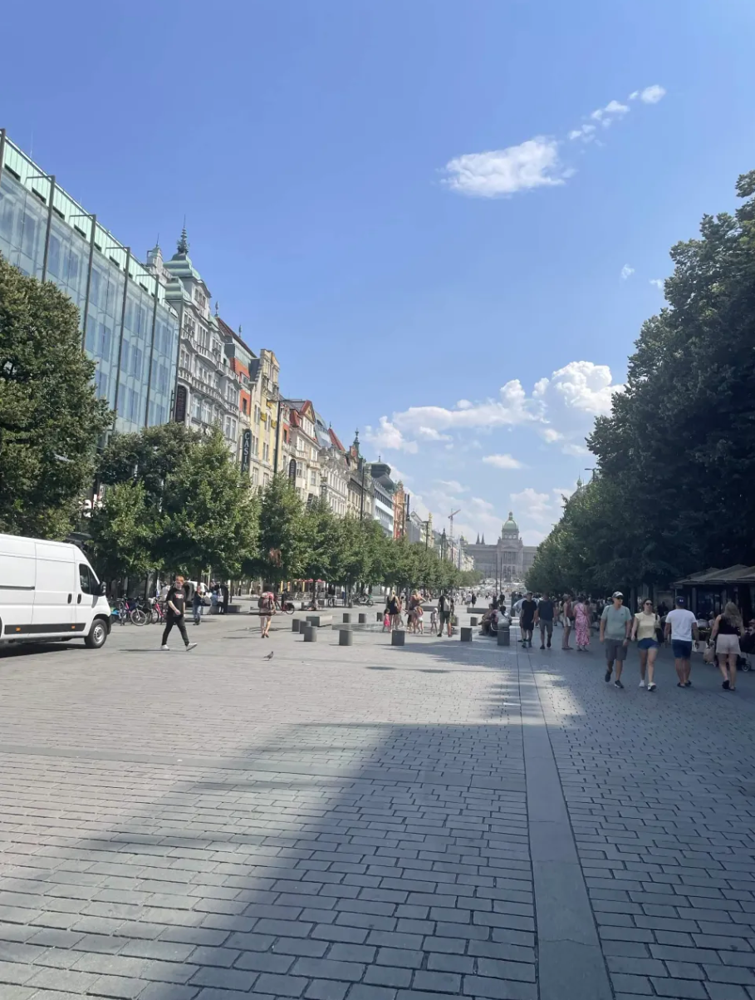 <em>Real-world view facing down Wenceslas Square</em></td>
<td width="50%" align="center">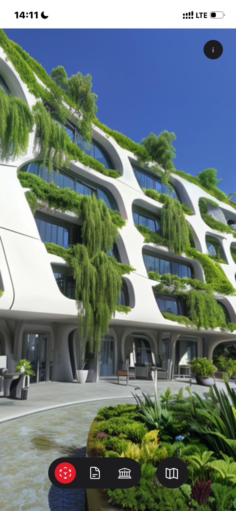 <em>AR-rendered "Urban Innovation" scene, same general direction</em></td>
</tr>
</table>

The two do not resemble each other at all — the real street (historic facades, trees, pedestrians) bears no visual relationship to the rendered futuristic building (organic white curved architecture with hanging greenery). This isn't a functional bug (the 360° scene itself renders and rotates correctly), but the disconnect between the real surroundings and the AR content is severe enough that it may undermine the "reimagined version of this exact place" premise of the experience — worth flagging as a content/design question for the team rather than treating as simply a stylistic nitpick.

### 4.5 Verified / Passed

- Language toggle present and accessible (T2.5, partial — toggle confirmed, translation quality not fully audited).
- Výtoň: portrait/landscape orientation switch — smooth, no issues.
- Výtoň: 3D model scaling (near/far) — correct.
- Výtoň: cannot plant in sky or on existing green areas — validation works.
- Výtoň: multiple taps at the same spot stack correctly.
- Palackého náměstí: 360° camera rotation while billboard is active — no issues.
- Palackého náměstí: tapping elsewhere correctly moves the billboard.
- Palackého náměstí: billboard only triggers when pointing at sky (not ground/building/water).
- Palackého náměstí: all 5 tested emojis produced correctly varied ad content.
- Náměstí Republiky: drone rendering quality itself — no issues.
- Na Příkopě: core historic-photo-overlay feature works, no crashes.
- Václavské náměstí: 360° look-around (rotation in place) — works correctly.
- PWA "Add to Home Screen" — passed on iOS. **Android not verified (device limitation), noted as a scope gap.**

---

## 5. Assumptions & Questions

- The task brief's example scenarios (Staroměstská personalized ads, Law Faculty cooling biotech grass) don't match the live app — the real personalized-ad scenario is at **Palackého náměstí**, and the cooling-grass scenario is at **Výtoň**. Assuming the live app is the source of truth, but flagging the mismatch rather than silently assuming.
- **Is location proximity meant to be enforced before a scenario can be started, or is "preview from anywhere" an intentional feature?** This is the single most important open question in this report — it determines whether GEN-02 (reproduced at 4 of 5 landmarks) is the most significant bug found, or expected behavior by design.
- Is the inconsistent Start-button label ("Start AR" / "Start 360° View" / "Start AI") intentional, given the experience types genuinely differ, or did it drift during development?
- Is losing state on app backgrounding (PN-01) and on full browser close (VY-02) intentional (stateless-by-design experience), or should progress be persisted (e.g. via local storage)?
- For VY-A02 (grass patch replacement) and VY-A01 (pinch-to-reduce-temperature): are these deliberate game mechanics I'm not aware of, or unintended side effects?

---

## 6. Status Update (Summary for Report)

- **Testing scope:** All 5 landmarks tested on-site (Náměstí Republiky, Na Příkopě, Václavské náměstí, Palackého náměstí, Výtoň), across multiple sessions.
- **Device/browser:** _(fill in phone model)_, Safari (primary). _(fill in if Chrome was also tested)_
- **Environment:** Mix of day/night conditions across sessions; outdoor on-site testing for the main sessions.
- **Overall:** Core AR rendering (drone, grass, ad billboard, 360° view, historic photo) works and looks solid across all 5 landmarks. The most significant finding is GEN-02 — the complete absence of location/proximity enforcement, reproduced consistently across 4 of the 5 landmarks — which is a question for the team rather than a confirmed bug, since it may be an intentional "preview from anywhere" design choice. Beyond that, most issues found are medium/low severity (state persistence on backgrounding/closing, minor placement-validation gaps, occasional unresponsive taps) rather than experience-breaking.

---
## Time Consuming 
The outdoor test lasted approximately 5 hours. 
QA Report took 2 hour and 24 minutes (Recorded by Clockify)

